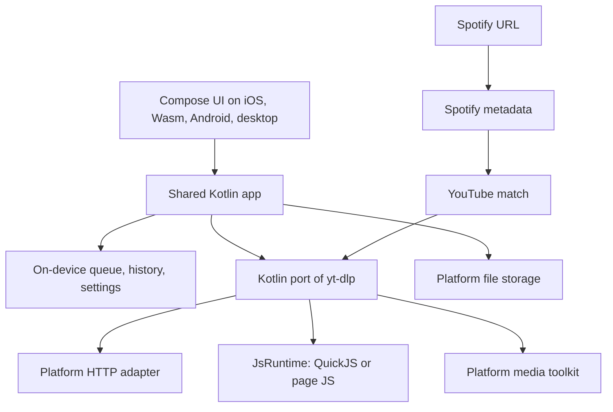
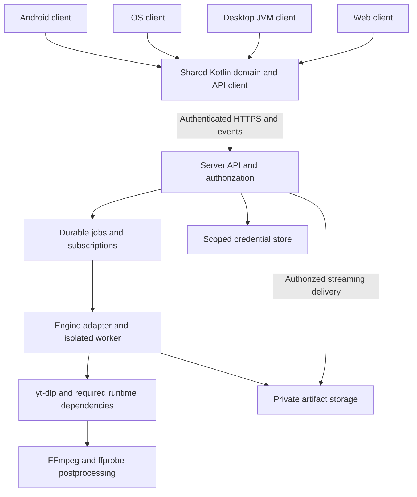

# Architecture

[Home](../Home.md) · [Platform matrix](Platform-matrix.md) · [Lifecycle](Download-lifecycle.md) · [API outline](API-outline.md) · [Decision log](../03-decisions/Decision-log.md)

**Accepted direction.** Extraction will run inside the app ([ADR-004](../03-decisions/ADR-004-Local-kotlin-engine.md)). Phase D2 ([ADR-006](../03-decisions/ADR-006-Local-http-engine-phase.md)) is done: a shared direct HTTP(S) file download, web through a browser extension, Android Chaquopy for other URLs, desktop CLI for non-direct URLs. Phase D3 ([ADR-007](../03-decisions/ADR-007-Generic-extractor-phase.md)) translated one generic-extractor subset; the media toolkit is recorded there and not built. Phase D4 ([ADR-008](../03-decisions/ADR-008-Extractor-core-and-youtube-phase.md)) builds the extractor core (`InfoExtractor` base, `InfoDict`/`MediaFormat`, registry, format-spec selector, HLS/DASH fragment downloaders, `_TESTS` harness, port manifest) and YouTube single video: JS-less `visionos` first, then yt-dlp-ejs through a `JsRuntime` port (Zipline QuickJS on JVM/Android/iOS, the page's own JavaScript on web). Progress toward yt-dlp is measured in the [equivalence matrix](../01-product/Ytdlp-equivalence.md).

## Local engine



- **Shared Kotlin:** extractors, download, typed options, queue, history, and Compose UI. A Spotify URL is metadata plus a YouTube or YouTube Music match, then the same engine. See [T-037](../06-tasks/T-037-Spotify-youtube-match.md).
- **Platform adapters:** HTTP (method, headers, body, range), file write, JavaScript runtime for the bundled challenge solver, share/open, and lifecycle. Common code does not spawn a process or assume Python.
- **Web:** Compose/Wasm UI. Downloads go through a local MV3 extension with host permissions ([T-043](../06-tasks/T-043-Web-extension-download.md)). The page does not fetch arbitrary origins.
- **iOS:** the same shared engine, with sandbox file export and no guarantee of work after suspension.

The draft `shared/network` API client was built for a server. The engine replaces that path.

## Superseded recommendation: remote-first clients

> [!warning] Withdrawn on 2026-09-21
> Kept so the original server design is still readable. Do not implement it.



The diagram describes responsibilities, **not a mandate for many microservices**. A self-hosted package may colocate API, worker, and storage while isolating untrusted engine execution. Engine network access is a separate trust boundary from API/client access.

## Client responsibilities

- **Shared Kotlin:** domain models, approved option models, validation, use cases, API DTOs/client, progress/state reducers, capability checks and retry/reconnect logic.
- **Shared UI candidate:** Compose Multiplatform for Android/iOS/JVM, and Compose/Wasm only after the web spike passes.
- **Platform adapters:** secure credential storage, file export, incoming share/deep links, notifications, background artifact transfers, lifecycle, browser authentication.
- **Not shared blindly:** `ProcessBuilder`, filesystem paths, OS credential APIs, browser DOM/permissions, or iOS background execution.

Candidate libraries are Kotlin coroutines/Flow, kotlinx.serialization, and Ktor Client. Pin compatible Kotlin/Compose/Gradle/Xcode versions only after [T-004](../06-tasks/T-004-Validate-KMP-targets.md). Client persistence library and web fallback are still open.

## Server responsibilities

Authenticate/authorize every operation; validate safe URL/options; own durable jobs and subscription scheduling; expose versioned capabilities and recoverable events; enforce quotas, egress and path restrictions; stream artifacts; manage secrets and retention.

Suggested initial persistence is SQLite for a single-owner host, subject to concurrency/recovery testing. Postgres or multi-node scheduling is not an initial requirement. The database, artifacts and credentials must never share a publicly browsable root.

## Backend alternatives to test

| Option | Advantages | Costs / evidence needed |
| --- | --- | --- |
| Existing MeTube server + KMP adapter | Fastest path to mature downloader behavior and many parity features. | API is implementation-specific and real-time transport is Socket.IO, not raw WebSocket. Validate mobile/Kotlin support, auth proxy behavior, error/option mapping, and AGPL obligations for any reuse/modification. |
| **Ktor/JVM API + isolated Python yt-dlp worker** | Kotlin-owned stable contract and domain; official Python API/progress hooks; engine updates decoupled from clients. | Two runtimes, worker lifecycle/IPC, queue/subscription implementation, packaging, and full parity workload. Proposed preference if effort is justified. |
| Python API/service with yt-dlp + KMP clients | Natural fit with extraction API; smaller engine boundary. | Less backend Kotlin; still requires durable state, security, protocol and parity work. |
| Native CLI adapters on each client | Potential standalone desktop/Android experience. | Does not provide a reliable common iOS/web engine; runtime/signing/background/license work on each OS. Optional track only. |

[T-005](../06-tasks/T-005-Choose-backend-engine.md) must compare these with the same fixtures and record the result in [ADR-003](../03-decisions/ADR-003-Backend-engine.md). Do not build both MeTube and a new server before deciding.

## Worker contract — suggested, not fixed

- An isolated process receives a validated immutable job request and secret references through private IPC, not interpolated shell commands.
- It emits bounded structured metadata/progress/result/error messages. Python hooks or structured yt-dlp output are preferred over parsing human terminal text.
- A job is successful only after postprocessing and artifact registration finish; engine exit alone is insufficient.
- Cancellation terminates the engine and child FFmpeg processes. Interrupted attempts are recoverable and do not masquerade as completed files.
- Pin yt-dlp, FFmpeg/ffprobe and required runtime components. Current YouTube support also needs yt-dlp-ejs and a supported JavaScript runtime; verify exact versions in the spike.
- Updates are controlled, tested and reversible, not arbitrary client-triggered executable replacement.

## Optional future module layout

Names below are illustrative; **these folders are not being scaffolded in M0**:

```text
shared/core/           Domain, use cases, typed options
shared/network/        Versioned contract and API client
shared/ui/             UI only where feasibility is proven
apps/android/          Android platform integration
apps/ios/              iOS host and platform integration
apps/desktop/          JVM desktop host
apps/web/              Browser entry and web-specific adapters
server/                Chosen API/control plane, if building one
worker/                Engine adapter, if building one
vault/                 Planning and documentation
```

## Consequences

The port is the product. Site coverage grows with implemented extractors. Spotify support follows that port by matching onto YouTube, recorded in [Client yt-dlp options](../05-research/Client-yt-dlp-options.md). Postprocessing needs a media toolkit on each target. Wasm and iOS feasibility is unproven. License obligations for yt-dlp-derived code and any copied spotDL matcher stay in [T-006](../06-tasks/T-006-Review-security-licensing.md).

See [ADR-004](../03-decisions/ADR-004-Local-kotlin-engine.md) and [ADR-002](../03-decisions/ADR-002-Kotlin-wrapper.md). The remote diagram above is historical.
