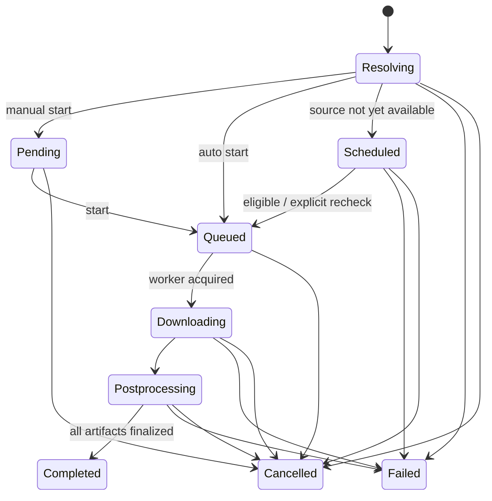

# Download lifecycle and domain

[Home](../Home.md) · [Architecture](Architecture.md) · [API outline](API-outline.md) · [Testing](../04-delivery/Testing-strategy.md)

On-device domain for the local engine. Not a claim that MeTube uses these exact entities. There is no server profile and no separate device-transfer entity.

## Core entities

| Entity | Purpose / important fields |
| --- | --- |
| Download request | Source URL, type/profile/quality, bounded playlist options, destination folder, selected presets, approved overrides, cookie reference, start policy. |
| Job | Stable ID, request, state, revision, timestamps, source metadata, parent batch/subscription ID. Stored on the device. |
| Attempt | Engine version, immutable effective options, progress, start/end, error category, redacted diagnostics, retry relationship. |
| Artifact | ID, owning job, relative path inside the app storage root, kind, media type, filename, size, optional checksum. |
| Subscription | Source, enabled state, interval/next check, name/filter, initial scan policy, options, bounded seen IDs, error/check history. Checks run while the app is open. |
| Preset / secret | Versioned approved options or a local cookie reference. Secrets are not written into logs or history rows. |

## Job states

The diagram is illustrative; T-011 must specify the complete transition table, including infrastructure failure/recovery from any active state. A **retry creates a new attempt** associated with the logical job and starts resolution/queueing again. It does not rewrite a failed attempt as if it never happened.

“Scheduled” initially means availability/waiting behavior for supported upcoming sources. User-chosen arbitrary calendar scheduling is not implicitly required. Subscription scheduling is a separate durable mechanism.

## Invariants to test

- A persisted accepted job survives app restart. On-device storage is authoritative; in-memory progress is not.
- Idempotency keys distinguish network retries from intentional repeat downloads. Playlist expansion needs per-child dedupe and bounded growth.
- Only one active attempt owns a job/worker lease. Restart marks abandoned attempts interrupted and safely requeues or fails them under policy.
- Completed means postprocessing, validation and artifact registration succeeded. Temporary/partial files must not be served as final output.
- Cancellation is race-safe and stops the in-app download and postprocess work; terminal completion versus cancel has a deterministic persisted winner.
- Percent/size/ETA may be unknown or reset between streams/phases. Preserve units, phase and attempt identity.
- UI updates come from the in-app job state. Duplicate progress events must not regress state.
- Partial download resumption depends on extractor, format, and temp-file availability. Cancellation/retry is not a universal pause/resume feature.
- Removing history, deleting the on-device file, and cancelling work are separate operations.

## Subscription specifics

Store seen IDs and scan outcome durably; define whether failed/skipped items remain eligible, how manual retries work, and how overlapping subscriptions avoid unintended duplicates. Bound scans and regex execution; coalesce overlapping checks. Persist UTC timestamps and define backoff/jitter and downtime catch-up policy. Cookies/options are referenced without exposing values.

## Suggested error categories

Invalid URL/options · unsupported source · unavailable/private media · site login required · rate limited · network failure · extraction failure · unsupported format · postprocessing failure · disk/quota exhausted · cancelled · engine unavailable.

Expose an actionable message and retryability. Raw extractor diagnostics, private URLs, headers, and cookie values are not safe to show in the UI or publish in bug reports.
