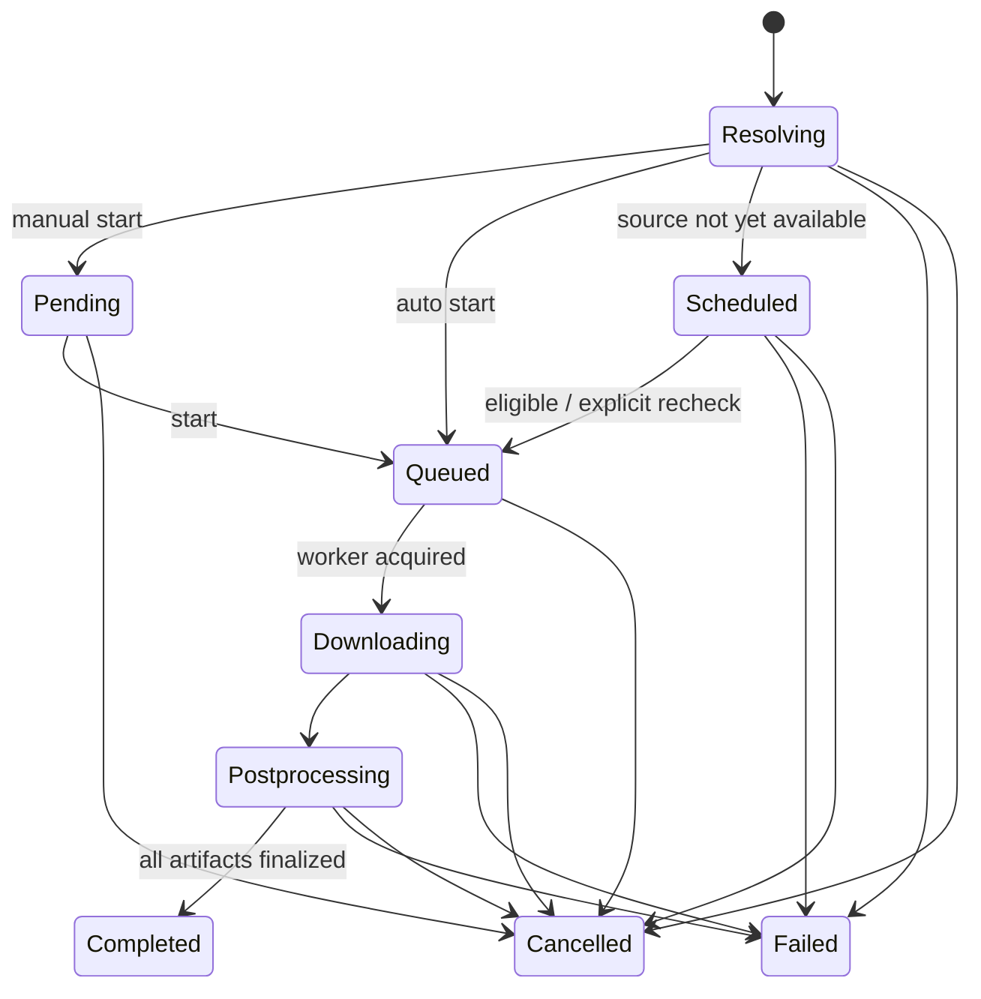

# Download lifecycle and domain

[Home](../Home.md) · [Architecture](Architecture.md) · [API outline](API-outline.md) · [Testing](../04-delivery/Testing-strategy.md)

This is a proposed application domain, not a claim that MeTube uses these exact entities or states.

## Core entities

| Entity | Purpose / important fields |
| --- | --- |
| Server profile | Trusted endpoint, API version/capabilities, credential reference; never embed credentials in URLs. |
| Download request | Source URL, type/profile/quality, bounded playlist options, relative destination, selected presets, approved overrides, cookie reference, start policy. |
| Job | Stable ID, owner, request, state, revision, timestamps, source metadata, parent batch/subscription ID. |
| Attempt | Engine version, immutable effective options, progress, start/end, error category, redacted diagnostics, retry relationship. |
| Artifact | ID, owning job/owner, relative private storage key, kind, media type, filename, size, optional checksum; not an exposed absolute path. |
| Device transfer | Artifact ID and local export state; independent of the server job. |
| Subscription | Source, enabled state, interval/next check, name/filter, initial scan policy, options, bounded seen IDs, error/check history. |
| Preset / secret | Versioned approved options or protected credential reference. Secrets are not serialized into job events. |

## Suggested server-job states

The diagram is illustrative; T-011 must specify the complete transition table, including infrastructure failure/recovery from any active state. A **retry creates a new attempt** associated with the logical job and starts resolution/queueing again. It does not rewrite a failed attempt as if it never happened.

“Scheduled” initially means availability/waiting behavior for supported upcoming sources. User-chosen arbitrary calendar scheduling is not implicitly required. Subscription scheduling is a separate durable mechanism.

## Invariants to test

- A persisted accepted job survives client disconnect and server restart. The database is authoritative; in-memory event streams are not.
- Idempotency keys distinguish network retries from intentional repeat downloads. Playlist expansion needs per-child dedupe and bounded growth.
- Only one active attempt owns a job/worker lease. Restart marks abandoned attempts interrupted and safely requeues or fails them under policy.
- Completed means postprocessing, validation and artifact registration succeeded. Temporary/partial files must not be served as final output.
- Cancellation is race-safe and terminates child processes; terminal completion versus cancel has a deterministic persisted winner.
- Percent/size/ETA may be unknown or reset between streams/phases. Preserve units, phase and attempt identity.
- UI reconnection uses revisions/cursors and snapshot reconciliation; duplicate/out-of-order events must not regress state.
- Partial download resumption depends on extractor/server/format/temp-file availability. Cancellation/retry is not a universal pause/resume feature.
- Removing history, deleting artifacts, cancelling work and deleting a device copy are separate operations with explicit authorization.

## Subscription specifics

Store seen IDs and scan outcome durably; define whether failed/skipped items remain eligible, how manual retries work, and how overlapping subscriptions avoid unintended duplicates. Bound scans and regex execution; coalesce overlapping checks. Persist UTC timestamps and define backoff/jitter and downtime catch-up policy. Cookies/options are referenced without exposing values.

## Suggested error categories

Invalid URL/options · unsupported source · unavailable/private media · authentication required · rate limited · network failure · extraction failure · unsupported format · postprocessing failure · disk/quota exhausted · cancelled · engine unavailable · authorization denied.

Expose an actionable message, retryability and a correlation ID. Raw engine stderr, private URLs, headers and cookie values are not automatically safe to return to clients or publish in bug reports.
